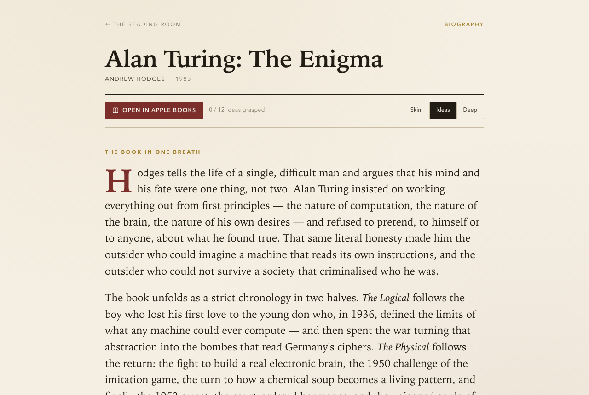
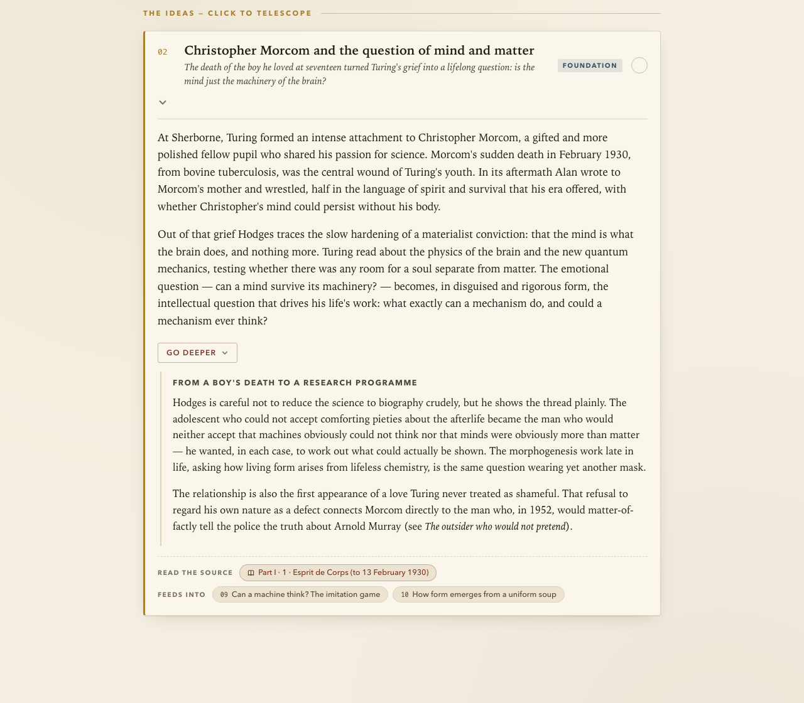
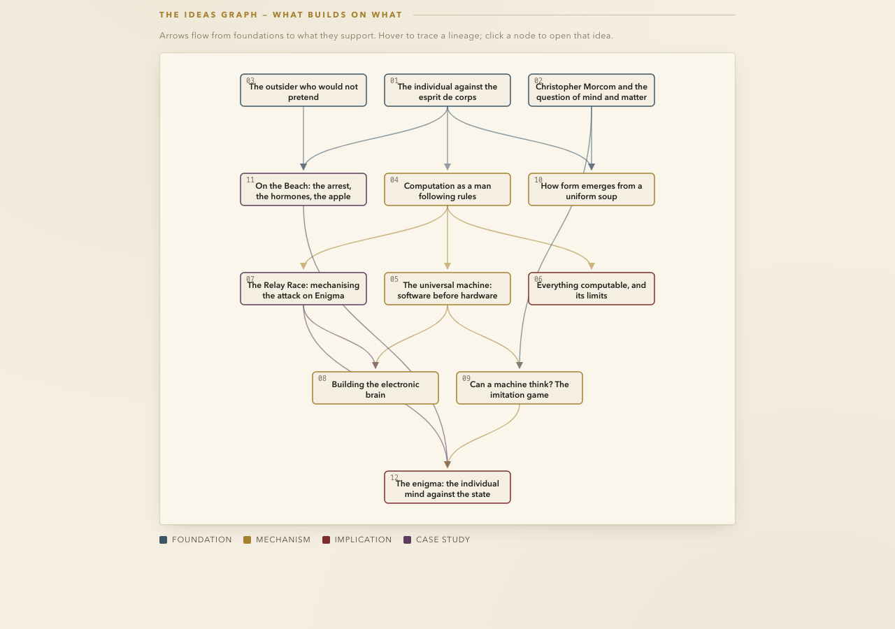

# Telestudy

My digital books and articles library was a graveyard of good intentions. I bet yours is as well.

Here's the problem with non-fiction books. You have a handful of good ideas. Maybe ten if you're lucky. Most only have a couple of really new ideas. But you still need to write hundreds of pages to justify a book for people to buy, and the reader still needs to read through these hundreds of pages to find those nuggets of originality wrapped in anecdotes, like a pearl hunter diving over the ocean surface looking for the occasional pearl. 

Telestudy is a skill I created to help me extract the pearls while still enjoying the narratives and anecdotes, when I choose. 
Telestudy stands for Telescopic Studies. It is a method of studying where I decide the altitude in which I want to study a book or a subject. Maybe initially I want to stay at 30,000 feet and skim through all of the main ideas of the book. Or maybe I want then to go one level deeper and understand the reasoning behind each idea. And perhaps then for handful of ideas I want to go down to 3,000 feet and read extensively about them. And perhaps for some I want to land on the ground and actually go back to the book and read an entire chapter verbatim. I have the zoom knob and I can use it to go high or go deep as I like. 

Point Telestudy at a book, a PDF, a paper, or an article, and it produces a single HTML study guide you can traverse at any altitude:

- **Skim** — every key idea as a one-liner. The whole book in two minutes.
- **Ideas** — each idea expanded with the book's actual examples, numbers, and characters.
- **Deep** — evidence, edge cases, and counterarguments for the ideas you decide you care about.
- **Source** — one click opens the actual chapter, in Apple Books (`ibooks://` deep link) or at the original URL.



Here's a single idea from the Alan Turing guide, telescoped all the way open — one-liner, summary, the deeper dive, and the chip that jumps you to the actual chapter:



And the part I use most: the **ideas graph**. Every guide maps which ideas depend on which — foundations, mechanisms, implications, practices — as an interactive DAG. Hover a node and its whole lineage lights up. Books are arguments, and arguments have structure; the graph is that structure made visible.



I ran it across my entire digital books shelf — 75 non-fiction books in one evening, a fleet of agents each grounding its guide in the actual text of the book. Every guide validated: connected acyclic graph, real chapter titles, quotes capped at fair-use length, no confabulated content.

## How it works

Telestudy is a [Claude Code](https://claude.com/claude-code) skill. The design is simple: **all rendering lives in one shared CSS + JS pair, and each guide is pure content** — a single HTML file with one JSON block describing the thesis, the ideas, the dependency edges, and the chapter map. No build step, no frameworks, no network. Guides open from the filesystem and will still open in twenty years.

```
Telestudy/
├── SKILL.md                     # the skill: ingest → author → validate workflow
├── assets/guide.css, guide.js   # the renderer (zero dependencies)
├── reference/SPEC.md            # the authoring contract: JSON schema, quality bar, graph rules
├── reference/exemplar.html      # a complete finished guide to copy from
└── scripts/
    ├── extract_structure.py     # real TOC from any epub or PDF — no invented chapters
    ├── validate.py              # JSON integrity, DAG connectivity, quote limits
    └── build_index.py           # regenerates the library bookshelf page
```

## Install

```bash
git clone https://github.com/eranshir/Telestudy.git ~/somewhere/Telestudy
ln -s ~/somewhere/Telestudy ~/.claude/skills/telestudy
```

That's it. Claude Code picks it up on the next session.

## Use

In any Claude Code session:

```
/telestudy this paper: ~/Downloads/attention-is-all-you-need.pdf
/telestudy "The Beginning of Infinity" from my Apple Books
/telestudy https://example.com/some-long-essay — standalone guide next to my notes
```

The skill extracts the real structure of the source, writes the guide against `reference/SPEC.md`, runs the validator, and either drops a standalone guide next to the source or adds it to your library and rebuilds the bookshelf. For a whole shelf at once, it fans out one agent per book and validates everything centrally — that's how the 75 got done.

## The contract

Each guide's JSON declares ideas with a `role` (foundation, mechanism, implication, practice, or case study) and `dependsOn` edges that mean one specific thing: *you must grasp X to fully get Y*. The validator enforces that the result is a connected DAG — no cycles, no orphan ideas. If an idea doesn't connect to the argument, either the edge is missing or the idea doesn't belong. That constraint, more than anything else, is what keeps the guides honest.

Try it on the next book you finish, and tell me what the graph shows you that the book's table of contents didn't.
